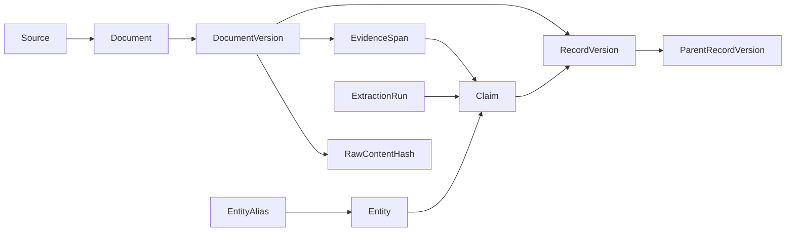

# Phase-two evidence storage

SQLite stores identities, observations, immutable document versions, claim spans,
and versioned domain records. Raw documents are content-addressed files under
`DATA_DIR/documents/<hash-prefix>/<sha256>.bin`; the database is
`DATA_DIR/research.sqlite3`. The Docker volumes retain both across container
replacement. This is persistence infrastructure, not a crawler or fact checker.

## Initialize and exercise it

From the repository root, using native Python:

```powershell
uv run --locked motorsport-research db-init
uv run --locked motorsport-research import-fixture tests/fixtures/evidence.json
uv run --locked motorsport-research storage-status
uv run --locked motorsport-research trace-claim REPLACE_WITH_RETURNED_CLAIM_ID
```

The checked-in fixture is entirely synthetic, uses `example.invalid`, and does not
represent a real investigation. Import it twice to verify stable document and claim
IDs. Each import appends an observation marked `fixture` with no invented HTTP
status. The CLI also accepts `import-fixture -` for JSON from stdin.

Compose runs a one-shot `storage-init` service before the dashboard or diagnostic
service starts. Its `db-init` command is idempotent and takes a SQLite write lock
while checking and applying migrations. Storage initialization requires no Ollama
connection and does not pull models.

`/health/storage` checks the installed schema and reads counts without modifying
the database. It returns 503 if storage is absent, outdated, inconsistent, or
unreadable. `/health/live` remains independent. Health counts are not a complete
archive audit; source bytes are verified when importing existing blobs or tracing
claims.

## Records and provenance



- Sources have stable registry keys, attribution, source type, and optional upstream
  source links. Reusing a key with different attribution is rejected; a future
  catalogue update must handle metadata changes explicitly.
- Documents have stable identity per source and canonical URL. URL fragments are
  removed; meaningful query parameters are retained. Credential-bearing URLs are
  rejected.
- A new latest content/metadata/parser fingerprint creates a revision. Repeating
  the current fingerprint reuses its version ID. A reversion to an older fingerprint
  creates a new chronological revision; it does not resurrect an old version as
  the latest. Identical raw bytes share one verified blob.
- Publication, retrieval, event, and effective times are distinct. Inputs require
  offsets when timestamps are known, normalize them to UTC, preserve supplied
  source timezone labels, and leave unknown times null. Retrieval records also
  retain their database recording time and method.
- Claims carry assertion type, attribution, related entities, optional superseded
  claim, and one or more evidence spans. Spans use zero-based Unicode character
  offsets into the exact stored extracted text, rather than UTF-8 byte offsets.
  Repeated quoted text requires an explicit start offset.
- Tracing verifies raw content hashes, extracted-text hashes, and exact quotes,
  then returns source URL, title, author, publication/retrieval times, parser
  version, and linked extraction metadata. A quote match establishes traceability;
  semantic support and truth assessment are later phases. New claims are
  `unassessed`, including those originating from an official source.
- Extraction records retain parser, optional model tag and immutable model-version
  identifier, and prompt version. Model-tagged runs require both model and prompt
  versions. Successful runs must refer to the same document version as the claim;
  multiple runs can link to the same idempotent claim.

## Identity and domain records

Entities include drivers, crews, cars, teams, manufacturers, governing bodies,
officials, and organizations. Supply a namespaced authoritative `identity_key`
when one is known. Names and aliases alone do not merge entities. Alias matching
normalizes Unicode form, case, and whitespace and optionally scopes by championship.
Resolution returns `missing`, `unique`, or `ambiguous` with candidate records.

Versioned record kinds cover seasons, meetings, sessions, classifications, decisions,
announcements, controversy cases, events, and report snapshots. They have stable
namespaced keys, source/claim references, related entities, applicable championships,
parser versions, and separately stored dates. `related_versions` pins exact parent
versions; season/meeting/session links check the parent's kind. Payloads are strict
JSON; championship-specific result validation and extraction arrive in phase four.

Announcements store issuer and jurisdiction when known. They can apply to several
championships or remain organization-wide. Controversy cases require a procedural
status, and closed cases require an explicit outcome. Each change appends a version,
preserving earlier allegations, responses, findings, or exonerations. No source label
or case status automatically changes a claim's evidence assessment.

The jobs and claim-assessment tables establish future storage interfaces. Scheduling,
automated corroboration, and report rendering are not implemented by this phase.

## Transactions, migrations, and integrity

Use `open_repository(data_dir)` as a transaction context for writes and
`open_repository(data_dir, read_only=True)` for reads. Writes use `BEGIN IMMEDIATE`,
foreign keys, WAL, and a busy timeout; exceptions escaping the context roll back
the batch. Read-only connections cannot initialize or mutate storage.

The first three packaged migrations establish evidence records, domain records, and
immutable history. Phase three adds a fourth migration for collection configurations,
runs, requests, caches, host pacing, and feed discovery. Migration names and
normalized-text SHA-256 checksums are recorded. Changed
applied migrations, missing history, and newer unsupported schemas are refused.
SQL is applied within one explicit transaction, including DDL; failed upgrades
preserve the previous schema and data. Historical rows and evidence links reject
updates/deletes; append revisions instead.

Document files are written and flushed before database references commit, using
atomic replacement and directory flushes on the Linux container filesystem. A
rolled-back batch can leave an unreferenced content-addressed file, but cannot
commit a reference to a file that the importer failed to write. Files are not
automatically deleted. Archive backup/restore and orphan cleanup policies belong
to the operations phase; corruption and missing files produce explicit failures.

The Windows/Ollama connection remains on the [deferred local checklist](LOCAL_VALIDATION.md).

## Phase-four normalization

Migration five adds `official_ingestions`; prior migrations and evidence remain
unchanged. A successful attempt identifies its original document version when
normalizing collection output, the normalized document version, exact sporting
record version, reviewed context and parser. Replays retain sporting record and
claim IDs while recording attempts. Parsing/import failures roll back domain
records and leave a failed audit; schema/file validation happens before ingestion.

Classifications link immutable season/meeting/session versions. Official standings
use classification records with `record_type: standings` and published scores.
Announcements/decisions retain exact passage selections, day-precision dates and
related record-version IDs in their payload. Decisions never apply an unverified
change to a classification. Multi-document WRC/WEC archives retain original
component bytes, URLs and checksums, plus original collected version IDs when
assembled with the bundle commands. See [official records](OFFICIAL_RECORDS.md).
